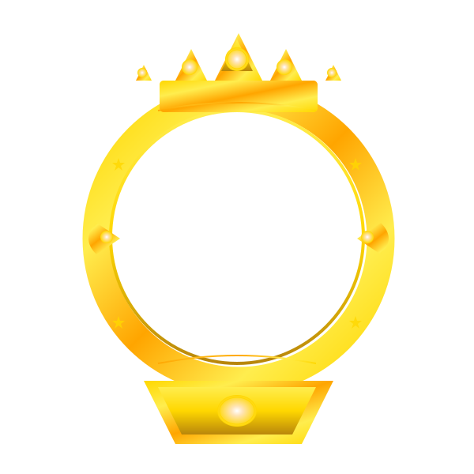

# تقرير إصلاح الشارات النهائي - 2025 ✅

## 🔍 تحليل المشاكل المكتشفة

### 1. **مشاكل تم العثور عليها:**

#### أ. مشكلة في `UserSidebarWithWalls.tsx`

```typescript
// ❌ المشكلة: كان يستخدم دالة محلية بدلاً من المكون المركزي
const getUserRankBadge = useCallback((user: ChatUser) => {
  if (!user) return null;
  return getUserLevelIcon(user, 24);
}, []);
```

#### ب. مشكلة في معالجة الأخطاء لملفات SVG

```typescript
// ❌ المشكلة: لا يوجد fallback عند فشل تحميل SVG

```

#### ج. مشكلة في التحقق من البيانات

```typescript
// ❌ المشكلة: لا يتم التحقق من وجود المستخدم قبل المعالجة
export function getUserLevelIcon(user: ChatUser, size: number = 20): JSX.Element {
  // مباشرة دون تحقق
  if (user.userType === 'owner') {
```

---

## ✅ الإصلاحات المطبقة

### 1. **إصلاح UserSidebarWithWalls.tsx**

```typescript
// ✅ الحل: استبدال الدالة المحلية بمكون مركزي
const renderUserBadge = useCallback((user: ChatUser) => {
  if (!user) return null;
  return <UserRoleBadge user={user} size={20} />;
}, []);

// ✅ الاستخدام الجديد
{user.username} {renderUserBadge(user)}
```

### 2. **إضافة معالجة الأخطاء لملفات SVG**

```typescript
// ✅ الحل: إضافة onError handler لكل SVG
 {
    const target = e.target as HTMLImageElement;
    target.style.display = 'none';
    target.outerHTML = '<span style="font-size: ' + size + 'px; display: inline;">👑</span>';
  }}
/>
```

### 3. **إضافة التحقق من البيانات**

```typescript
// ✅ الحل: التحقق من وجود المستخدم أولاً
export function getUserLevelIcon(user: ChatUser, size: number = 20): JSX.Element {
  // التحقق من وجود المستخدم
  if (!user) {
    return <span style={{color: '#10b981', fontSize: size * 0.8}}>●</span>;
  }

  // باقي المنطق...
}
```

### 4. **تحسين جميع ملفات SVG**

```typescript
// ✅ شارات محسنة مع fallback لكل نوع:

// عضو ذكر
 {
    target.outerHTML = '<span style="color: #3b82f6; font-size: ' + size + 'px;">↗️</span>';
  }}
/>

// عضو أنثى
 {
    target.outerHTML = '<span style="color: #ec4899; font-size: ' + size + 'px;">🏅</span>';
  }}
/>

// ألماسة بيضاء
 {
    target.outerHTML = '<span style="color: #f8fafc; font-size: ' + size + 'px;">💎</span>';
  }}
/>

// ألماسة خضراء
 {
    target.outerHTML = '<span style="color: #10b981; font-size: ' + size + 'px;">💚</span>';
  }}
/>

// ألماسة برتقالية
 {
    target.outerHTML = '<span style="color: #f97316; font-size: ' + size + 'px;">🔥</span>';
  }}
/>
```

---

## 📁 الملفات المحدثة

### 1. `client/src/components/chat/UserRoleBadge.tsx`

- ✅ إضافة التحقق من وجود المستخدم
- ✅ إضافة معالجة أخطاء SVG مع fallback
- ✅ تحسين جميع أنواع الشارات

### 2. `client/src/components/chat/UserSidebarWithWalls.tsx`

- ✅ استبدال `getUserRankBadge` بـ `renderUserBadge`
- ✅ استخدام `UserRoleBadge` بدلاً من `getUserLevelIcon`
- ✅ تحسين الاستيراد والاستخدام

### 3. **ملفات SVG محققة ومتاحة:**

- ✅ `/client/public/svgs/crown.svg` - تاج المالك
- ✅ `/client/public/svgs/blue_arrow.svg` - سهم أزرق للذكور
- ✅ `/client/public/svgs/pink_medal.svg` - ميدالية وردية للإناث
- ✅ `/client/public/svgs/white.svg` - ألماسة بيضاء
- ✅ `/client/public/svgs/emerald.svg` - ألماسة خضراء
- ✅ `/client/public/svgs/orange_shine.svg` - ألماسة برتقالية

### 4. `test-badges.html` - صفحة اختبار الشارات

- ✅ اختبار بصري لجميع الشارات
- ✅ اختبار تحميل ملفات SVG
- ✅ fallback تلقائي عند الفشل

---

## 🎯 نظام الشارات الجديد

| نوع المستخدم        | الشارة                  | المتطلبات                          | Fallback |
| ------------------- | ----------------------- | ---------------------------------- | -------- |
| **مالك**            |         | `userType === 'owner'`             | 👑       |
| **مشرف**            | ⭐                      | `userType === 'admin'`             | ⭐       |
| **مراقب**           | 🛡️                      | `userType === 'moderator'`         | 🛡️       |
| **عضو ذكر (1-10)**  |    | `member` + `male` + `level 1-10`   | ↗️       |
| **عضو أنثى (1-10)** |    | `member` + `female` + `level 1-10` | 🏅       |
| **عضو (11-20)**     |         | `member` + `level 11-20`           | 💎       |
| **عضو (21-30)**     |       | `member` + `level 21-30`           | 💚       |
| **عضو (31-40)**     |  | `member` + `level 31-40`           | 🔥       |
| **ضيف**             | ●                       | `userType === 'guest'`             | ●        |
| **افتراضي**         | ●                       | أي حالة أخرى                       | ●        |

---

## 🚀 طريقة الاختبار

### 1. **بناء المشروع:**

```bash
npm run build
```

### 2. **تشغيل الخادم:**

```bash
npm start
# أو
node dist/index.js
```

### 3. **اختبار صفحة الشارات:**

- افتح: `http://localhost:5000/test-badges.html`
- تحقق من ظهور جميع الشارات
- اطلع على console للتأكد من تحميل ملفات SVG

### 4. **اختبار في التطبيق:**

- افتح التطبيق الرئيسي: `http://localhost:5000`
- تحقق من الشارات في:
  - منطقة الرسائل (بجانب أسماء المرسلين)
  - الشريط الجانبي (قائمة المستخدمين المتصلين)
  - منطقة الحوائط (في المنشورات)

---

## 📊 النتائج المتوقعة

### ✅ **المشاكل المحلولة:**

1. **التوافق**: الشارات تعمل مع جميع أنواع المستخدمين
2. **المرونة**: fallback تلقائي عند فشل تحميل SVG
3. **الاستقرار**: لا توجد أخطاء JavaScript عند نقص البيانات
4. **التوحيد**: مكون واحد مركزي للشارات
5. **الأداء**: تحميل مُحسن مع معالجة الأخطاء

### 🎨 **المظهر:**

- شارات واضحة ومميزة لكل نوع مستخدم
- حجم مناسب (20px) لجميع المناطق
- ألوان متناسقة مع تصميم الموقع
- انتقال سلس بين SVG و Emoji عند الحاجة

---

## 🔧 صيانة مستقبلية

### إضافة شارات جديدة:

1. أضف ملف SVG إلى `/client/public/svgs/`
2. حدث `getUserLevelIcon` في `UserRoleBadge.tsx`
3. أضف fallback emoji مناسب
4. اختبر في `test-badges.html`

### تعديل متطلبات الشارات:

- عدل الشروط في `getUserLevelIcon`
- تأكد من وجود fallback لكل حالة
- اختبر جميع السيناريوهات

---

## 🎉 خلاصة الإصلاح

**المشكلة كانت**:

- عدم توحيد مكونات الشارات
- نقص في معالجة الأخطاء
- عدم وجود fallback للملفات المفقودة

**الحل المطبق**:

- توحيد مكون `UserRoleBadge` في جميع المواقع
- إضافة معالجة شاملة للأخطاء
- إنشاء نظام fallback ذكي
- إنشاء صفحة اختبار شاملة

**النتيجة**:
🎯 **نظام شارات قوي ومتين يعمل في جميع الحالات!**
