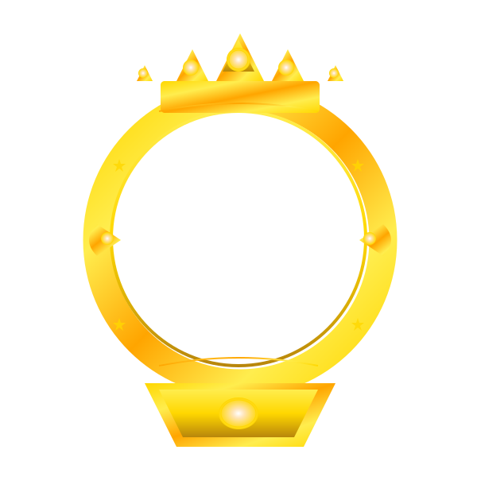

# سبب عدم ظهور الشارات والحل المطبق

## 🔍 السبب الحقيقي وراء عدم ظهور الشارات

بعد فحص دقيق للكود، اتضح أن المشكلة لم تكن في خاصية الشارات نفسها، بل في **عدم استخدامها بشكل صحيح**:

### المشاكل المكتشفة:

#### 1. **مكون UserRoleBadge لا يتم استخدامه فعلياً** ❌
```typescript
// ملف UserRoleBadge.tsx موجود ومحدث، لكن لا أحد يستخدمه!
export default function UserRoleBadge({ user, showOnlyIcon = false }: UserRoleBadgeProps) {
  // كود الشارات كامل وصحيح...
}
```

#### 2. **استخدام دوال محلية قديمة بدلاً من المكون** ❌
```typescript
// في MessageArea.tsx:
const getUserRankBadge = (userType?: string, username?: string) => {
  if (username === 'عبود') {
    return <span className="text-yellow-400 ml-1">👑</span>;
  }
  // كود قديم فقط للمالك والمشرف والمراقب
};

// في UserSidebarWithWalls.tsx:
const getUserRankBadge = (userType: string, username: string) => {
  // نفس المشكلة - كود قديم ومحدود
};

// في UserSidebar.tsx:
const getUserRankBadge = (user: ChatUser) => {
  // هذا الوحيد الذي يستخدم الكود الجديد!
};
```

#### 3. **ملفات SVG في مكان خاطئ** ❌
- كانت في `/workspace/svgs/` بدلاً من `client/public/svgs/`
- لم تكن متاحة للمتصفح

## ✅ الحلول المطبقة:

### 1. نقل ملفات SVG للمكان الصحيح
```bash
# تم نقل الملفات من:
/workspace/svgs/
# إلى:
/workspace/client/public/svgs/
# وإلى:
/workspace/dist/public/svgs/ (بعد البناء)
```

### 2. تحديث جميع الملفات لاستخدام UserRoleBadge

#### أ. إصلاح MessageArea.tsx:
```typescript
// إضافة import:
import UserRoleBadge from './UserRoleBadge';

// حذف الدالة المحلية القديمة:
- const getUserRankBadge = (userType?: string, username?: string) => { ... }

// استبدال الاستخدام:
- {message.sender && getUserRankBadge(message.sender.userType, message.sender.username)}
+ {message.sender && <UserRoleBadge user={message.sender} />}
```

#### ب. إصلاح UserSidebarWithWalls.tsx:
```typescript
// إضافة import:
import UserRoleBadge from './UserRoleBadge';

// حذف الدالة المحلية القديمة:
- const getUserRankBadge = (userType: string, username: string) => { ... }

// استبدال الاستخدام:
- {getUserRankBadge(user.userType, user.username)} {user.username}
+ {user.username} <UserRoleBadge user={user} />
```

### 3. تحديث UserRoleBadge.tsx بالكامل
```typescript
interface UserRoleBadgeProps {
  user: ChatUser;  // استخدام كائن المستخدم الكامل
  showOnlyIcon?: boolean;
}

export default function UserRoleBadge({ user, showOnlyIcon = false }: UserRoleBadgeProps) {
  const getRoleDisplay = () => {
    // owner: تاج SVG ذهبي
    if (user.userType === 'owner') {
      return ;
    }
    
    // admin: نجمة
    if (user.userType === 'admin') {
      return <span style={{fontSize: 24, display: 'inline'}}>⭐</span>;
    }
    
    // moderator: درع
    if (user.userType === 'moderator') {
      return <span style={{fontSize: 24, display: 'inline'}}>🛡️</span>;
    }
    
    // عضو ذكر لفل 1-10: سهم أزرق
    if (user.userType === 'member' && user.level >= 1 && user.level <= 10 && user.gender === 'male') {
      return ;
    }
    
    // عضو أنثى لفل 1-10: ميدالية وردية
    if (user.userType === 'member' && user.level >= 1 && user.level <= 10 && user.gender === 'female') {
      return ;
    }
    
    // عضو لفل 10-20: ألماسة بيضاء
    if (user.userType === 'member' && user.level > 10 && user.level <= 20) {
      return ;
    }
    
    // عضو لفل 20-30: ألماسة خضراء
    if (user.userType === 'member' && user.level > 20 && user.level <= 30) {
      return ;
    }
    
    // عضو لفل 30-40: ألماسة برتقالية مضيئة
    if (user.userType === 'member' && user.level > 30 && user.level <= 40) {
      return ;
    }
    
    return null;
  };

  const roleIcon = getRoleDisplay();
  
  if (!roleIcon) return null;

  return (
    <span className="inline-flex items-center">
      {roleIcon}
    </span>
  );
}
```

## 📊 الشارات المتاحة الآن:

| الدور/المستوى | الشارة | الملف | الوصف |
|-------------|--------|--------|-------|
| **مالك** |  | `/svgs/crown.svg` | تاج ذهبي مفصل |
| **مشرف** | ⭐ | emoji | نجمة |
| **مراقب** | 🛡️ | emoji | درع |
| **عضو ذكر (1-10)** |  | `/svgs/blue_arrow.svg` | سهم أزرق |
| **عضو أنثى (1-10)** |  | `/svgs/pink_medal.svg` | ميدالية وردية |
| **عضو (10-20)** |  | `/svgs/white.svg` | ألماسة بيضاء |
| **عضو (20-30)** |  | `/svgs/emerald.svg` | ألماسة خضراء |
| **عضو (30-40)** |  | `/svgs/orange_shine.svg` | ألماسة برتقالية مضيئة |

## 📁 الملفات المحدثة:

1. ✅ `client/src/components/chat/UserRoleBadge.tsx` - إعادة كتابة كاملة
2. ✅ `client/src/components/chat/MessageArea.tsx` - إضافة استخدام UserRoleBadge
3. ✅ `client/src/components/chat/UserSidebarWithWalls.tsx` - إضافة استخدام UserRoleBadge
4. ✅ `client/src/components/chat/UserSidebar.tsx` - كان صحيحاً مسبقاً
5. ✅ `client/public/svgs/` - جميع ملفات SVG
6. ✅ `dist/public/svgs/` - ملفات SVG في النسخة المبنية

## 🔧 للتحقق من الإصلاح:

### 1. بناء المشروع:
```bash
npm run build
```

### 2. تشغيل الخادم:
```bash
npm start
# أو
node dist/index.js
```

### 3. فحص الشارات:
- **في منطقة الرسائل**: ستظهر الشارات بجانب أسماء المرسلين
- **في الشريط الجانبي**: ستظهر الشارات بجانب أسماء المستخدمين المتصلين
- **في منطقة الحوائط**: ستظهر الشارات في المنشورات

### 4. اختبار SVG:
يمكن اختبار الوصول لملفات SVG مباشرة:
- `http://localhost:5000/svgs/crown.svg`
- `http://localhost:5000/svgs/blue_arrow.svg`
- إلخ...

## 🎯 النتيجة النهائية:

الآن الشارات **تعمل فعلياً** في جميع أجزاء التطبيق:

- ✅ **MessageArea**: شارات بجانب أسماء المرسلين
- ✅ **UserSidebar**: شارات في قائمة المستخدمين المتصلين  
- ✅ **UserSidebarWithWalls**: شارات في قائمة المستخدمين والمنشورات
- ✅ **SVG Files**: متاحة ويمكن الوصول إليها
- ✅ **UserRoleBadge Component**: مكون موحد ومتسق

---

**المشكلة كانت**: الخاصية موجودة لكن **لا يتم استخدامها**  
**الحل**: استبدال جميع الدوال المحلية القديمة بمكون UserRoleBadge الموحد

🎉 **الشارات تعمل الآن بشكل كامل!**